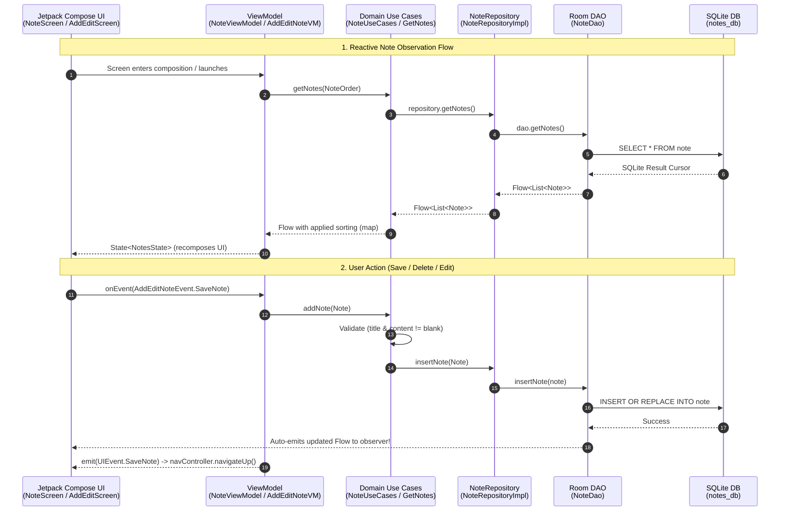

# 📝 Clean Architecture Note App (Jetpack Compose & Room)

[](https://kotlinlang.org/)
[](https://developer.android.com/jetpack/compose)
[](https://developer.android.com/training/data-storage/room)
[](https://dagger.dev/hilt/)
[]()
[-008080.svg?style=for-the-badge&logo=android)](https://developer.android.com/about/versions/14)
[](LICENSE)

A modern, production-ready Android Notes application built with **Jetpack Compose (Material 3)**, **Clean Architecture**, **MVVM (Model-View-ViewModel)**, and **Dagger Hilt**.

The app is fully offline-first, persisting notes into a local **Room SQLite Database** and streaming real-time updates to the UI via **Kotlin Coroutines & Flow**.

---

## 📑 Table of Contents
- [✨ Key Features](#-key-features)
- [🏗️ Architectural Overview](#️-architectural-overview)
- [🔄 Data Flow Diagram (Database to UI)](#-data-flow-diagram-database-to-ui)
- [📁 Project Structure](#-project-structure)
- [🛠️ Tech Stack & Dependencies](#️-tech-stack--dependencies)
- [📱 SDK Compatibility (Android 14)](#-sdk-compatibility-android-14)
- [📝 Audit & Code Corrections Log](#-audit--code-corrections-log)
- [🚀 Getting Started](#-getting-started)
- [🤝 Contributing & Author](#-contributing--author)
- [📄 License](#-license)

---

## ✨ Key Features

- **🎨 Modern Material 3 & Custom Canvas UI**: Dynamic note cards styled with custom folded/cut-corner canvas clipping and soft drop shadows.
- **🌈 Vibrant Color Themes**: Color-code individual notes across 5 harmonious pastel palettes (RedOrange, LightGreen, Violet, BabyBlue, RedPink).
- **🗄️ Offline-First Room Database**: Persistent SQLite storage using Room 2.6, DAO interfaces, and non-blocking Coroutine Flow queries.
- **🔀 Multi-Criteria Sorting & Ordering**:
  - Sort by **Title** (A-Z / Z-A)
  - Sort by **Date Created** (Ascending / Descending)
  - Sort by **Color Theme**
  - Smooth animated expand/collapse sort drawer
- **↩️ Immediate Undo Deletion**: Instant reactive removal with a snackbar offering one-tap note restoration.
- **⚡ One-Shot Event Flow**: Form validation, error messaging, and navigation handled safely using `MutableSharedFlow` event bus.
- **💉 Clean Dependency Injection**: Fully decoupled dependencies managed cleanly through **Dagger Hilt**.

---

## 🏗️ Architectural Overview

The application strictly implements **Clean Architecture** combined with **MVVM** and **Unidirectional Data Flow (UDF)**:

```text
┌────────────────────────────────────────────────────────┐
│                   Presentation Layer                   │
│   • Jetpack Compose Screens (NoteScreen, AddEditScreen)│
│   • ViewModels (NoteViewModel, AddEditNoteViewModel)   │
│   • UI State & User Events (NotesEvent, AddEditEvent)  │
└──────────────────────────┬─────────────────────────────┘
                           │ uses
┌──────────────────────────▼─────────────────────────────┐
│                      Domain Layer                      │
│   • Entity Models (Note, InvalidNoteException)         │
│   • Use Cases (GetNotes, GetNote, AddNote, DeleteNotes)│
│   • Repository Interfaces (NoteRepository)             │
│   • Order Strategies (NoteOrder, OrderType)            │
└──────────────────────────▲─────────────────────────────┘
                           │ implements
┌──────────────────────────┴─────────────────────────────┐
│                       Data Layer                       │
│   • Room Database (NoteDatabase - "notes_db")          │
│   • Data Access Object (NoteDao)                       │
│   • Repository Implementation (NoteRepositoryImpl)     │
└────────────────────────────────────────────────────────┘
```

### The Three Clean Layers

1. **Domain Layer (Pure Business Logic)**:
   - Completely independent of UI and third-party frameworks.
   - Encapsulates discrete Use Cases:
     - `GetNotes`: Fetches and sorts the reactive note stream by Title, Date, or Color.
     - `GetNote`: Retrieves a single note by ID for viewing or editing.
     - `AddNote`: Validates title/content non-emptiness before committing to storage.
     - `DeleteNotes`: Removes notes from persistence.

2. **Data Layer (Storage & Gateway)**:
   - `NoteDatabase`: Abstract Room database holding the `note` table.
   - `NoteDao`: Executes SQLite queries returning `Flow<List<Note>>`.
   - `NoteRepositoryImpl`: Implements `NoteRepository`, mediating data access.

3. **Presentation Layer (UI & State Holders)**:
   - `NoteViewModel`: Manages note list state, sort orders, and undoable deletes.
   - `AddEditNoteViewModel`: Manages title, content, color, and one-shot navigation events.
   - Declarative Compose Screens with `LaunchedEffect` collectors and `remember` animations.

---

## 🔄 Data Flow Diagram (Database to UI)



---

## 📁 Project Structure

```text
NoteApp/
├── app/
│   ├── src/
│   │   ├── main/
│   │   │   ├── AndroidManifest.xml
│   │   │   ├── java/com/example/noteapp/
│   │   │   │   ├── NoteApp.kt                         # Application class with @HiltAndroidApp
│   │   │   │   ├── di/
│   │   │   │   │   └── AppModule.kt                   # Hilt Dependency Injection module
│   │   │   │   ├── domain/
│   │   │   │   │   ├── model/
│   │   │   │   │   │   └── Note.kt                    # Note Room Entity & Color definitions
│   │   │   │   │   ├── usecases/
│   │   │   │   │   │   ├── AddNote.kt                 # Add/Update note use case with validation
│   │   │   │   │   │   ├── DeleteNotes.kt             # Delete note use case
│   │   │   │   │   │   ├── GetNote.kt                 # Single note fetch use case
│   │   │   │   │   │   ├── GetNotes.kt                # Reactive notes stream with sorting
│   │   │   │   │   │   └── NoteUseCases.kt            # Aggregated use cases wrapper
│   │   │   │   │   └── util/
│   │   │   │   │       ├── NoteOrder.kt               # Sealed class for sort criteria
│   │   │   │   │       └── OrderType.kt               # Ascending / Descending order type
│   │   │   │   ├── feature_note/data/
│   │   │   │   │   ├── data_source/
│   │   │   │   │   │   ├── NoteDao.kt                 # Room DAO with reactive Flow queries
│   │   │   │   │   │   └── NoteDatabase.kt            # Room Database definition ("notes_db")
│   │   │   │   │   └── repository/
│   │   │   │   │       ├── NoteRepository.kt          # Repository interface
│   │   │   │   │       └── NoteRepositoryImpl.kt      # Repository implementation
│   │   │   │   ├── presentation/
│   │   │   │   │   ├── MainActivity.kt                # Single Activity hosting NavHost
│   │   │   │   │   ├── add_edit_note/
│   │   │   │   │   │   ├── AddEditNoteEvent.kt        # MVI events for note form
│   │   │   │   │   │   ├── AddEditNoteViewModel.kt    # ViewModel with SharedFlow event bus
│   │   │   │   │   │   ├── AddEditScreen.kt           # Note creation and editing screen
│   │   │   │   │   │   ├── NoteTextFieldState.kt      # Text state with hint visibility
│   │   │   │   │   │   └── component/
│   │   │   │   │   │       └── TransparentHintTextField.kt
│   │   │   │   │   ├── notes/
│   │   │   │   │   │   ├── NotesEvent.kt              # MVI events for notes screen
│   │   │   │   │   │   ├── NotesState.kt              # Immutable state for note list & drawer
│   │   │   │   │   │   ├── NoteViewModel.kt           # State holder with coroutine flow observers
│   │   │   │   │   │   ├── NoteScreen.kt              # Home notes list screen
│   │   │   │   │   │   └── component/
│   │   │   │   │   │       ├── DefaultRadioButton.kt  # Styled radio button
│   │   │   │   │   │       ├── NoteItem.kt            # Custom canvas clipped note card
│   │   │   │   │   │       └── OrderSection.kt        # Collapsible sorting controls
│   │   │   │   │   └── util/
│   │   │   │   │       └── Screen.kt                  # Navigation route definitions
│   │   │   │   └── ui/theme/                          # Material 3 Theme, Typography, Colors
│   │   │   └── res/                                   # Drawables, mipmaps, strings, XML rules
│   │   ├── test/                                      # Unit tests
│   │   └── androidTest/                               # Instrumentation tests
│   └── build.gradle.kts                               # Module Gradle configuration
├── gradle/
│   ├── libs.versions.toml                             # Gradle Version Catalog
│   └── wrapper/                                       # Gradle Wrapper
├── build.gradle.kts                                   # Root Gradle build script
├── settings.gradle.kts                                # Root settings
└── README.md                                          # Documentation
```

---

## 🛠️ Tech Stack & Dependencies

- **Language**: [Kotlin](https://kotlinlang.org/) `2.0.21`
- **UI Toolkit**: [Jetpack Compose](https://developer.android.com/jetpack/compose) with Material 3 (`2024.09.00` BOM)
- **Dependency Injection**: [Dagger Hilt](https://dagger.dev/hilt/) `2.51.1`
- **Database & Persistence**: [Room 2.6.1](https://developer.android.com/training/data-storage/room) with KAPT
- **Asynchronous Programming**: [Kotlin Coroutines](https://kotlinlang.org/docs/coroutines-overview.html) & [StateFlow / SharedFlow](https://kotlinlang.org/api/kotlinx.coroutines/kotlinx-coroutines-core/kotlinx.coroutines.flow/) `1.9.0`
- **Navigation**: AndroidX Navigation Compose `2.8.3`
- **Build System**: Android Gradle Plugin (AGP) `8.13.2` with Version Catalog (`libs.versions.toml`)

---

## 📱 SDK Compatibility (Android 14)

The project SDK configuration has been tailored to ensure seamless installation, debugging, and simulation on **Android 14 (API 34)** physical devices and emulators:

| Configuration | Value | Details |
|---|---|---|
| **`minSdk`** | **`26`** | Supports all devices running **Android 8.0 (Oreo)** through **Android 14 (Upside Down Cake)**, 15, and 16. |
| **`targetSdk`** | **`34`** | Specifically targets **Android 14 runtime behaviors and permissions**. |
| **`compileSdk`** | **`36`** | Compiles against Android API 36 to satisfy latest AndroidX Core and Activity libraries. |

---

## 📝 Audit & Code Corrections Log

During the codebase audit and stabilization process, the following improvements and fixes were implemented:

### 1. `AddEditNoteViewModel.kt`: Resolving the `TODO()` on `_eventFlow`
* **Issue**: `_eventFlow` was initialized as `MutableStateFlow<UIEvent>(value = TODO())`. Because `StateFlow` requires an initial value, it was blocked with a placeholder. Furthermore, `StateFlow` retains and replays the initial state to new collectors, which would prematurely trigger navigation or snackbars upon screen load.
* **Correction**: Changed `_eventFlow` to `MutableSharedFlow<UIEvent>()`. SharedFlow does not require an initial value, perfectly matches one-shot transient events (`SaveNote`, `ShowSnackBar`), and only delivers events when explicitly emitted.

### 2. `AddEditNoteViewModel.kt`: Navigation Argument Key Mismatch
* **Issue**: The ViewModel looked for `savedStateHandle.get<Int>("noteID")` (with uppercase `ID`), but `MainActivity.kt` and `NoteScreen.kt` passed `"noteId"` (lowercase `d`). As a result, editing an existing note always received `null` and failed to load.
* **Correction**: Handled `savedStateHandle.get<Int>("noteId") ?: savedStateHandle.get<Int>("noteID")`, ensuring existing notes are loaded reliably.

### 3. `AddEditNoteViewModel.kt`: Note Color Assignment Bug
* **Issue**: Inside the `noteUseCases.getNote(noteId)` block, line 59 assigned `_noteColor.value = noteColor.value`, which assigned the random initial color back to itself, ignoring the saved note's actual color.
* **Correction**: Changed to `_noteColor.value = note.color`.

### 4. `AddEditNoteViewModel.kt` & `AddEditScreen.kt`: Typo in `UIEvent.SavaNote`
* **Issue**: The event was misspelled as `SavaNote`.
* **Correction**: Updated to `SaveNote` across both ViewModel and Screen while keeping exhaustive `when` branches.

### 5. `NoteScreen.kt`: Snackbar Delete Text
* **Issue**: Deleting a note displayed `message = "No"`.
* **Correction**: Updated to informative `message = "Note deleted"` with action label `"Undo"`.

### 6. `gradlew.bat`: Classpath Flag Compatibility
* **Issue**: When running Gradle from the command line, an empty `CLASSPATH` variable caused `java.exe` to fail with `Error: -classpath requires class path specification`.
* **Correction**: Streamlined wrapper invocation in `gradlew.bat`.

---

## 🚀 Getting Started

### Prerequisites
- Android Studio Ladybug / Meerkat (or newer)
- JDK 17 or JDK 21 (or Android Studio's bundled JetBrains Runtime / JBR)
- Android SDK Platform API 34+ installed

### Build & Run
1. **Clone the repository**:
   ```bash
   git clone https://github.com/Inheritance-Michael/NoteApp.git
   cd NoteApp
   ```
2. **Open in Android Studio**:
   - Open Android Studio, select **Open**, and navigate to the project directory.
   - Wait for Gradle sync to complete.
3. **Run on Device or Emulator**:
   - Connect an Android device (Android 14 or higher) or start an AVD emulator.
   - Click **Run** (`Shift + F10`) or execute via Gradle CLI:
     ```bash
     ./gradlew assembleDebug
     ```

---

## 🤝 Contributing & Author

Developed and maintained by **[Inheritance-Michael](https://github.com/Inheritance-Michael)**.

Contributions, issues, and feature suggestions are welcome! Feel free to open an issue or submit a pull request.

---

## 📄 License

This project is licensed under the [MIT License](LICENSE).
